# Table of contents

* [Project Objectives](#project-objectives)
* [Project Management](#project-management)
* [User experience and design](#user-experience-and-design)
* [Features](#features)
* [Technologies used](#technologies-used)
* [Testing](#testing)
* [Deployment](#deployment)
* [Credits & Acknowledgements](#credits)

# The Final Whistle

The Final Whistle is a full stack web application built using the Django Framework. The main purpose of the site is to provide a platform for the user to write a short blog posting their opinion on the current affairs that is happening in football. The intended target audience is anyone who has an interest in football from teenagers to adults. 

The application has full CRUD functionality for user generated posts and provides an easy for other users of the site to comment on the posts upvote and downvote posts and create their own accounts as well.

The site also features a back-end admin dashboard that allows admin of the site to review and authorise posts as well as comments.

The site is hosted on Heroku the link is below

[The Final Whistle](https://the-final-whistle.herokuapp.com/)

[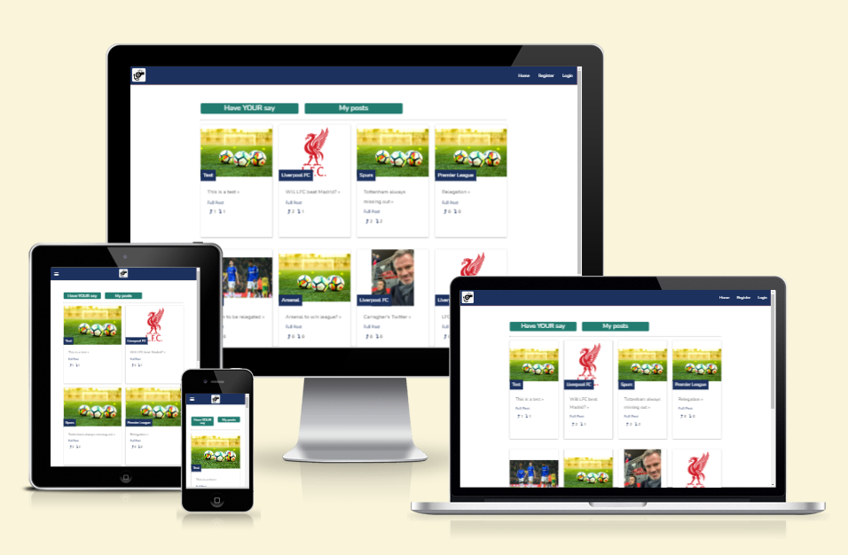](https://the-final-whistle.herokuapp.com/)

# Project objectives

## Main objective

The main objective of this project was to create a full stack website as part of [The Code Institute](https://codeinstitute.net/) Diploma in Full Stack Software Development.
This project is my fourth portfolio project on the course. Amongst other assessment criteria, this project had to be built using HTML, CSS, JavaScript, Python and the Django framework, and feature full CRUD functionality and user authorisation. The project also had to be planned and designed using agile methodologies. 

One of my main interests is sports I decided to create a website where users of the site can create posts about the current affairs in football.

My aim was to create a minimum viable product that can be built upon with more features in the future and also to create a website that I would enjoy creating and using in the future as well.

## Site users

Users of the site can create posts, and comments, upvote and downvote posts and add tags to their own created posts. Users can view, edit and delete their own posts also.
I tried to make the site as appealing as it could be to as broad of an audience as possible with a clear layout an easy way of learning how to use the site and the ability to 
customise the created posts with an image.

## Site owner

The goal for the site owner is to provide a stable user experience that is enjoyable to encourage user interaction. The site should be accessible and appealing to new users, it should also be scalable with an easy way to add more features in the future. Content on the site should be easily moderated to ensure community standards are met and be of high quality. 

[Back to table of contents](#table-of-contents)

# Project management

## Agile development

I managed this project using an [Agile](https://agilemanifesto.org/) methodology. The Agile method I implemented was the use of a Kanban board. I used GitHub projects to refine epic tasks to break them down into user stories. This ensured that tracking and organising the project into iterations was manageable. The GitHub project board had a to do section where user stories where first placed, an in progress tab where user stories where moved to when being worked on, a done section where the stories where moved when completed. A bugs tab for any coding problems that arose during the process and a won't-have section for features that where not included in this stage of the project.

[The Final Whistle user stories](https://github.com/users/carl2087/projects/7)

I also used GitHub projects to organise my project tasks in the same way this included tasks such as creating wireframes, choosing the colour theme for the site and writing the readme document.

[The Final Whistle project tasks](https://github.com/users/carl2087/projects/8)

## GitHub stories images

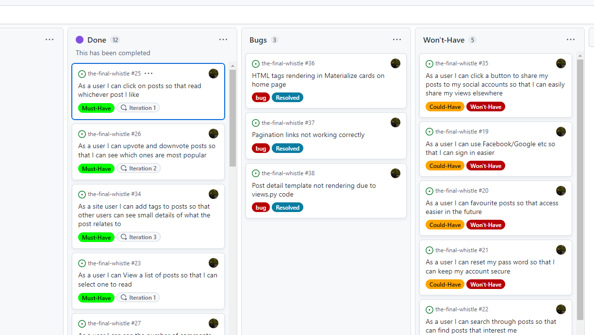 
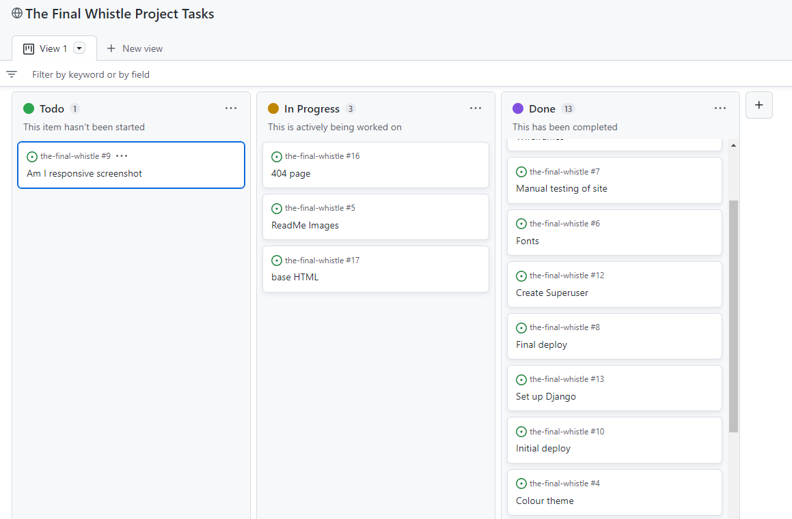

## Database schema

I drew the database schemas up in Microsoft Excel The schema diagrams were used to plan the database models, fields and also the relationships between the models and how they would interact with each other. The Final Whistle consists of two models one for comments and one for posts. There is an opportunity to create a third model for the football teams in a future release of the site.

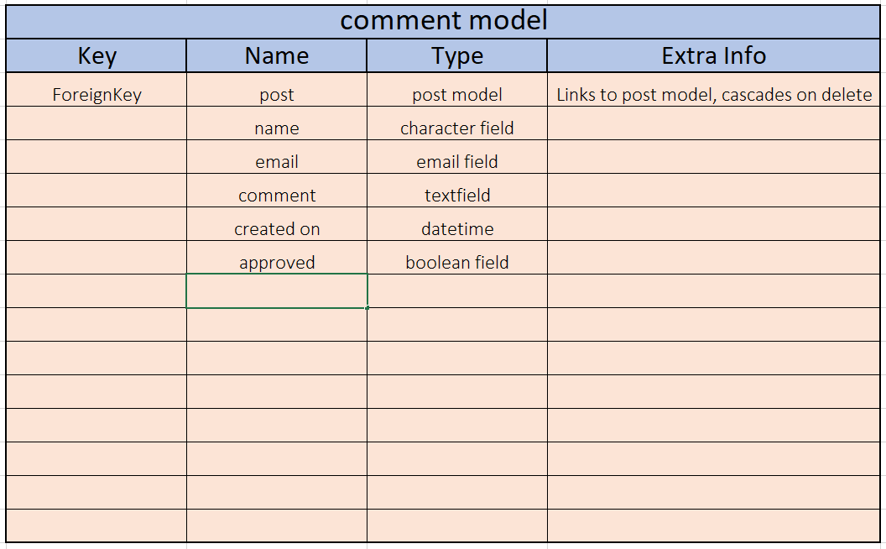
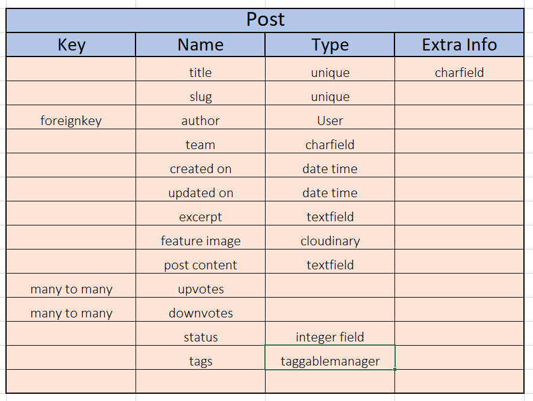

[Back to table of contents](#table-of-contents)

# User experience and design

When planning the site and how it would affect the user experience is first created wireframes for the project to decide on the layout of each page.
I then used [Color Hunt](https://colorhunt.co/) to decide on the colour theme for the site. I used Google fonts to decide on which fonts I would use for the site. I have included images below relating to the steps I undertook.

## Wireframe images

### Home page for desktop

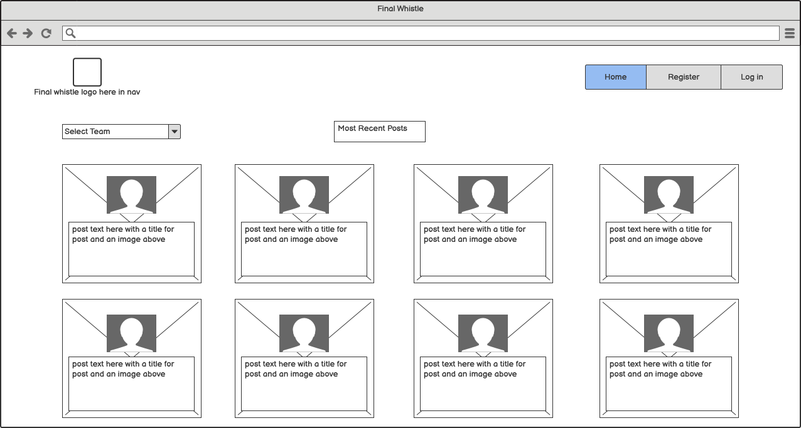

### Home page for tablet

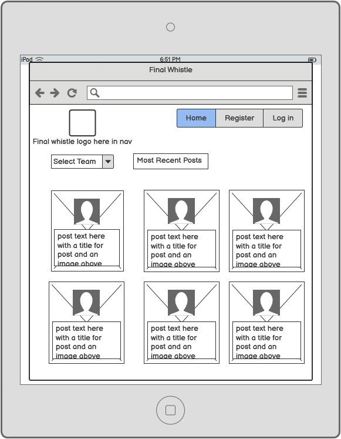

### Home page for mobile phone

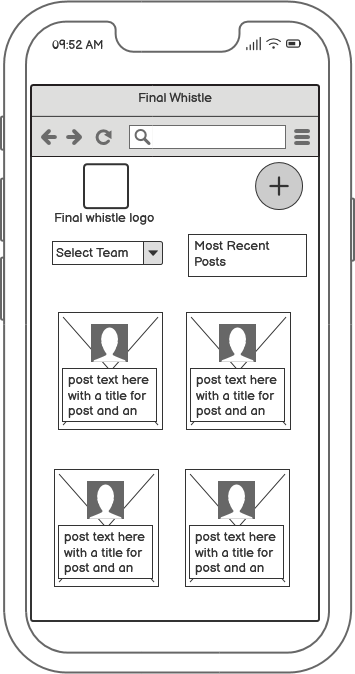

### Create a post page 

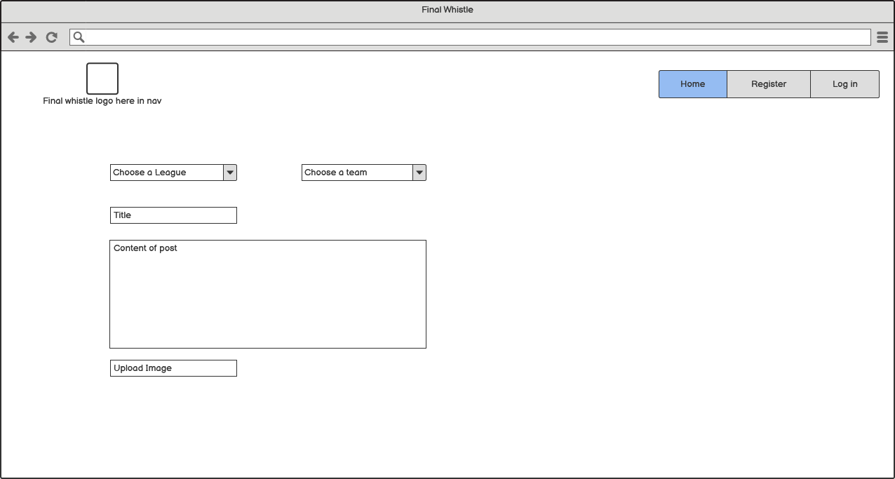

### Create a post page tablet 

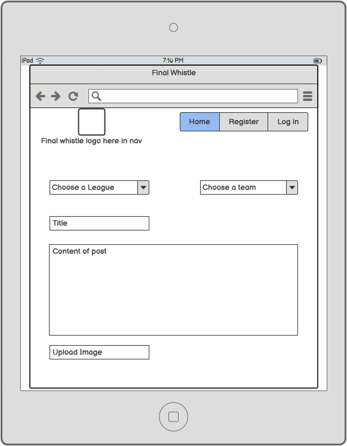

### Create a post page mobile phone

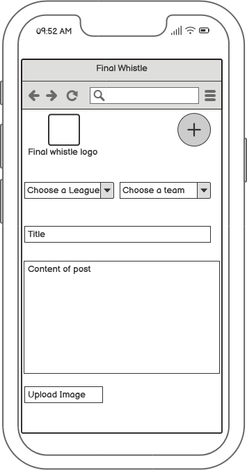

### Comment page 

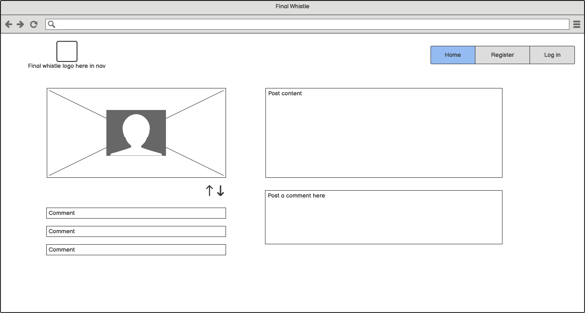

### Comment page tablet

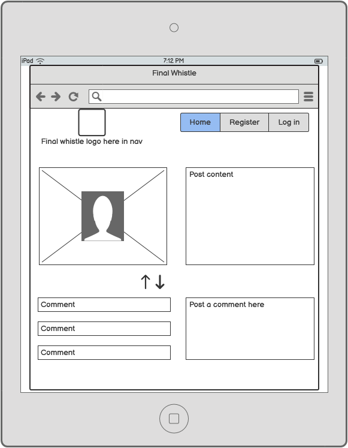

### Comment page mobile phone

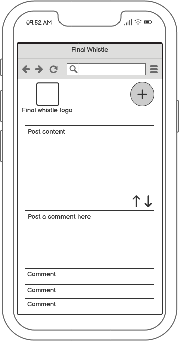

### Login and user register pages

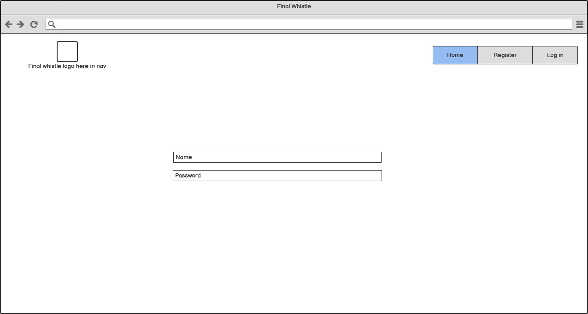
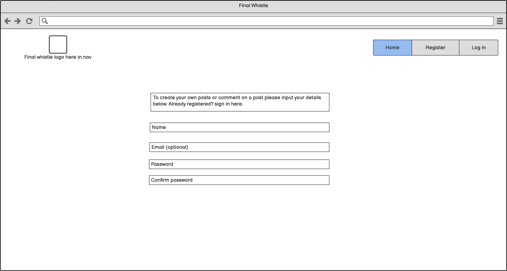

### Login and user register pages

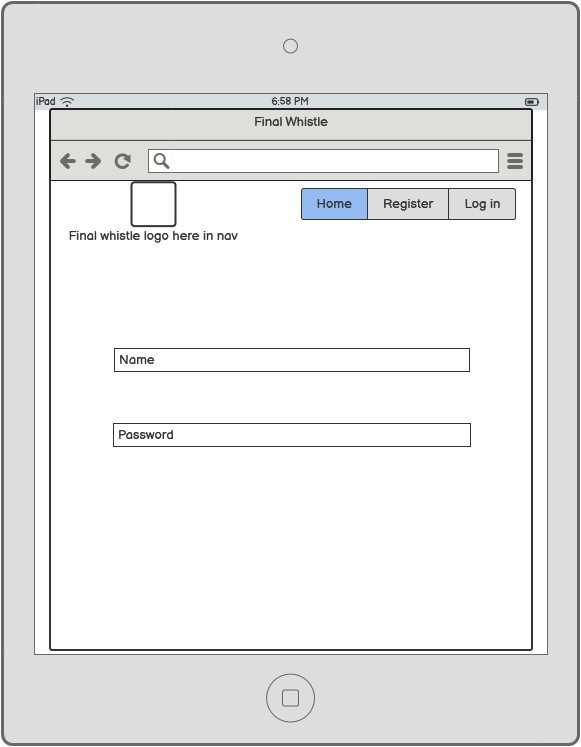
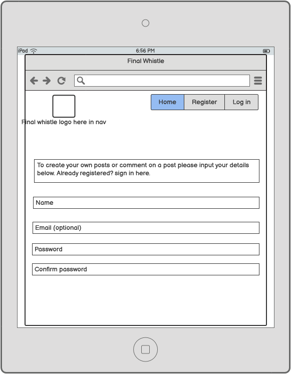

### Login and user register pages

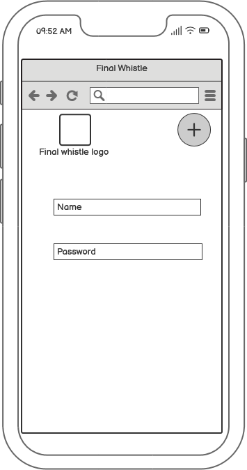

## Colour scheme

I used [Color Hunt](https://colorhunt.co/) to select the colour scheme for the site. I decided to use the colour palette below as the colours are not too bright and work well together.

Color hunt palette

Color hunt palette codes

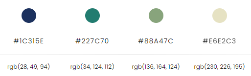

## Logo 

For the logo I used a whistle icon from [flaticon](https://www.flaticon.com/free-icon/whistle_3627675?term=whistle&page=1&position=34&origin=search&related_id=3627675) the use of this logo is free as long as it is attributed. I placed the whistle icon on a white square background with rounded corners.

## Favicon

I created the favicon on [real favicon generator](https://realfavicongenerator.net/). I used the whistle icon above to keep the design of the site consistent.

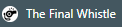

## Typography

I used Google fonts to decide on which type of fonts to use on The Final Whistle for headings and titles I used [Nunito](https://fonts.google.com/specimen/Nunito) and for bodies of text I used [Rubik](https://fonts.google.com/specimen/Rubik). I chose these fonts because they are clear and synergize well together I chose to use a different fonts for headers and bodies of text just to give the site some nice customization.

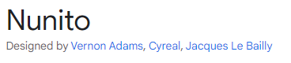
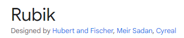

## CSS framework

To help speed up design and building of the site I decided to use the Materialize front-end framework I chose this because firstly I like the way the cards looked and worked which forms the basis of the index page on the site and also to challenge myself to use a different framework from Bootstrap. This did have it's challenges along the way to ensure everything worked as it should but in the end I think it was the right choice and would do it again.

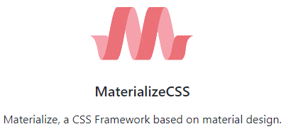

## Site structure

I tried to keep the site structure simple, clean and easy to learn how to use. To encourage users of the site to want to come back and use it again and again. Content is hidden from users of the site who are not logged in and prompt the user to register or login to access the different areas of the site. The navbar at the top of the page will change options depending on the login state of the site user.

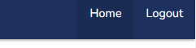
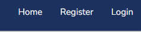

[Back to table of contents](#table-of-contents)

# Features

## Existing features

### Home page

The home page is the first page of the site that users see when they navigate to The Final Whistle URL. It's designed to be simple with eye-catching cards with images that relate to the post users can click the title of the post to initiate a card action that reveals the excerpt of the post to give the user a small glimpse of what the post says if they then decide to click on the full post link they will be taken to the post detail screen where they can read the full post or comment on the post.

Home page Desktop

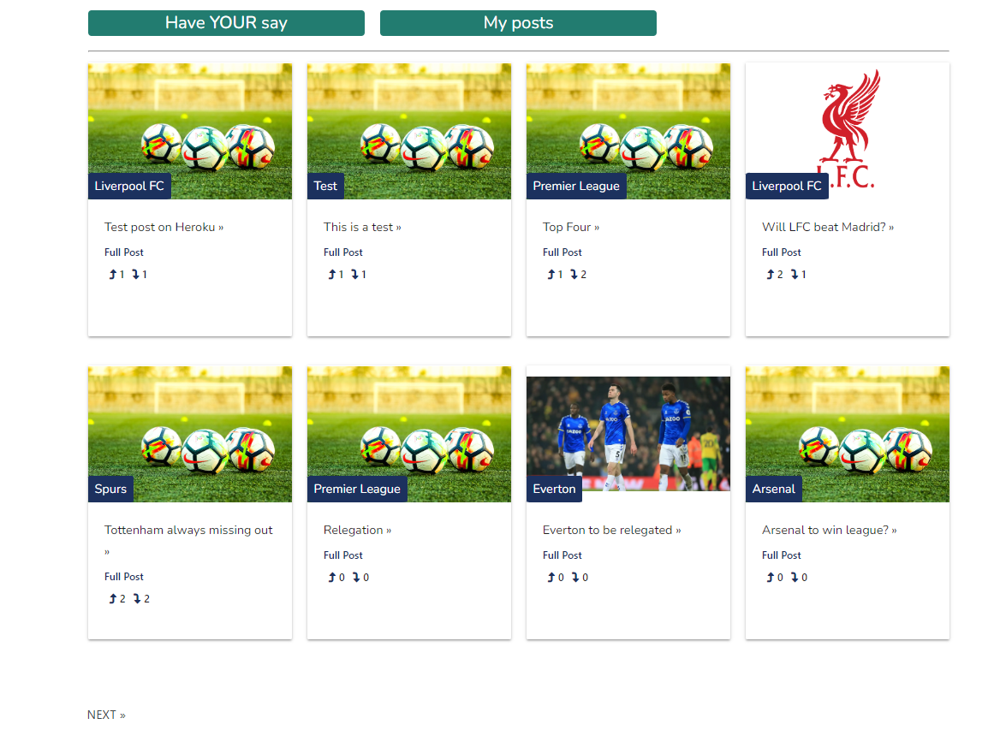

Home page tablet

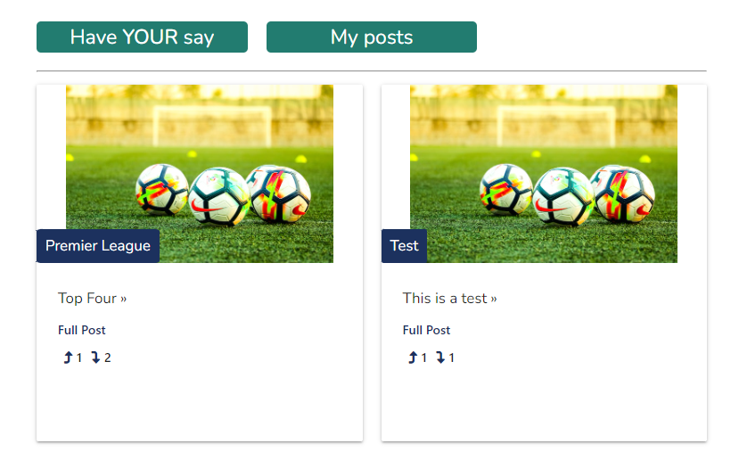

Home page mobile phone

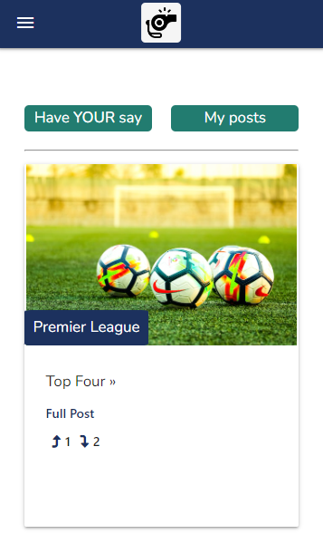

### Navbar

The site has a navbar along the top which has links for the home page which is The Final Whistle logo and depending on the current logged in state for the user there will be links to register and login or logout. There is also a home button link as well which is always visible. On smaller devices The Final Whistle logo moves to the centre of the navbar and a hamburger menu appears with the relevant site links nested inside.

Desktop navbar

Tablet and mobile home page

Hamburger menu

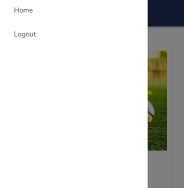

### Footer

The footer for The Final Whistle has the title of the site and also has social links to popular platforms where The Final Whistle will have presence when clicked on they open in a new tab to keep the site ready and waiting to go back to.

Desktop Footer

Tablet and mobile footer

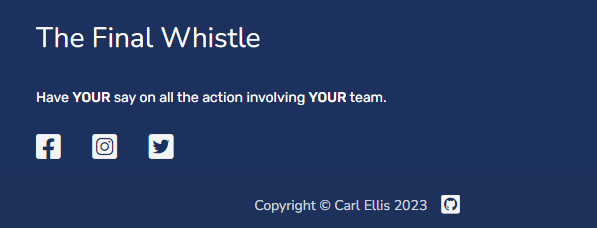

### Create a post 

On this page this enables a registered or logged in user to create a post if the user is not logged in they will be prompted to create an account or sign in to their account. The form will prompt the user if they have not filled out a required part of the form. The user can choose whether they want to upload their own image if the user declines to do so, a generic image is added automatically. When a user has successfully submitted a post they are shown a message that lets them know that their post is awaiting approval.

Create a post page

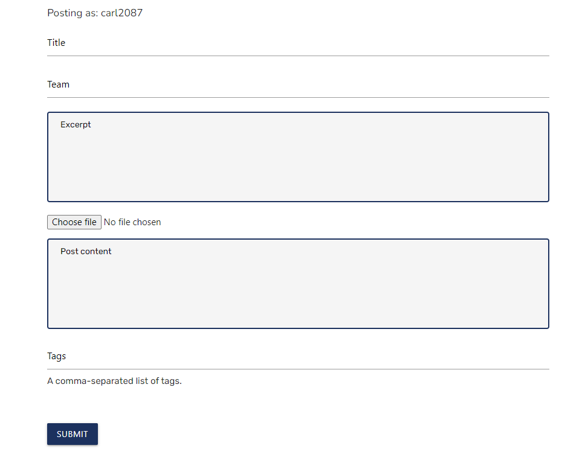

Screen when not logged in 

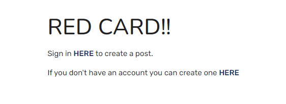

Post successful message

### My posts page

There is a link on the home page that will take the user to their own posts page which has links underneath each post that allow the user to edit their own posts and also delete their own posts as well if a user decides to edit their own posts they are taken to a new screen with the edit a post form which is pre-populated with the data that was entered on the original post. On this page there is a submit button to save the changes and a cancel button which will give the user chance to confirm the cancel in case it was pressed accidentally by the way of a modal appearing. The delete button works the same way a modal appears to give the user the chance to confirm the delete or cancel the delete. If the user is not logged in or registered they will be taken to a screen to prompt them to log in or register an account.

My posts page

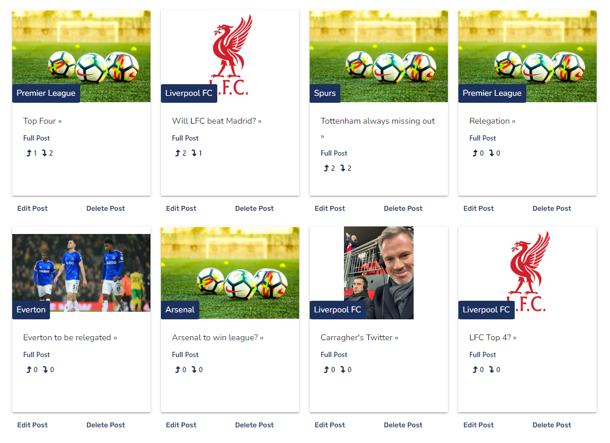

Edit post

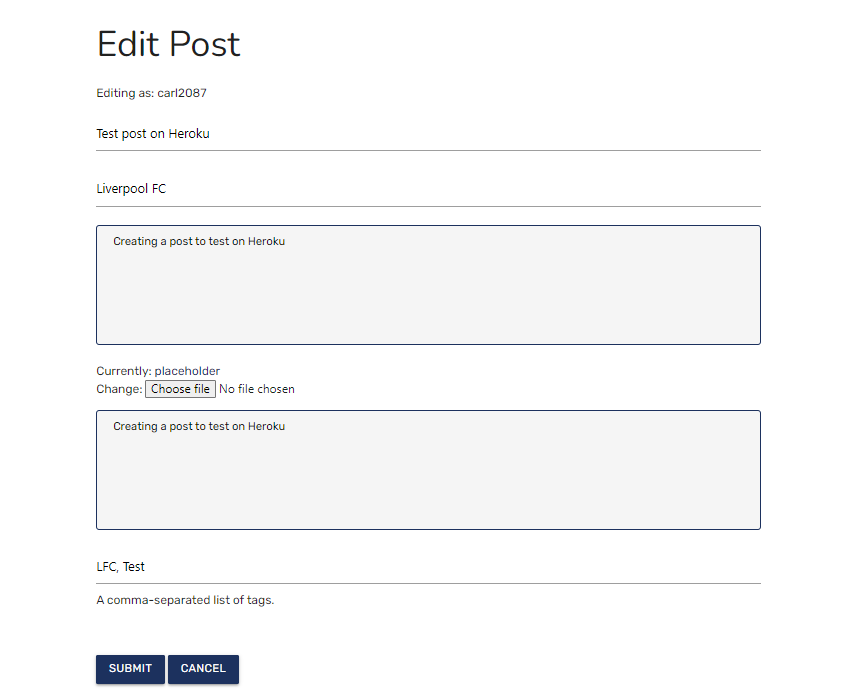

Edit successful message

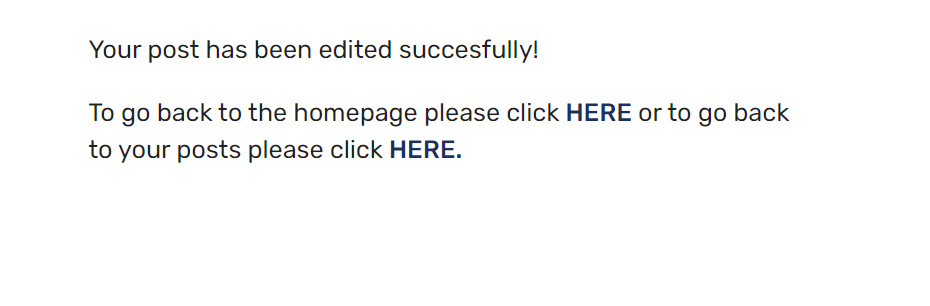

Cancel edit post modal

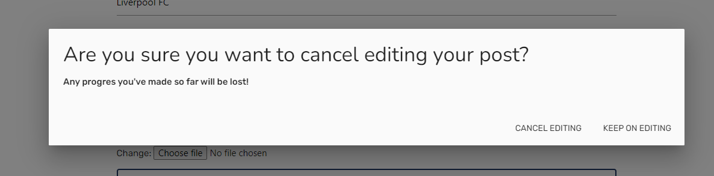

Delete post modal

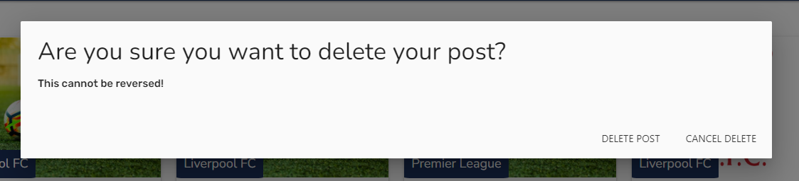

Not logged in page

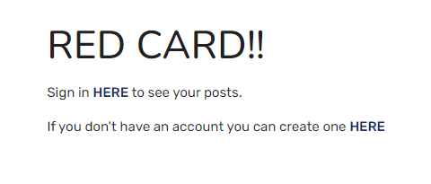

### Post detail page

When a user clicks on the full post link on the cards that feature on the home page they are taken to the post detail page. The post detail page features an enlarged image that was uploaded with the post that if clicked on will go full screen to give the user a better experience of viewing it. The comments made on the post are underneath the image. With the post content to the right of the image there are icons underneath the text that show the number of comments made and gives the option to upvote and downvote the post. The arrows are only clickable if the user is logged in and will be red rather than blue if the user has clicked on them also if the user is logged in they will be able to comment on the post and if they are not logged in there is a link instead asking them to log in to be able to leave a comment. 

Post detail page desktop

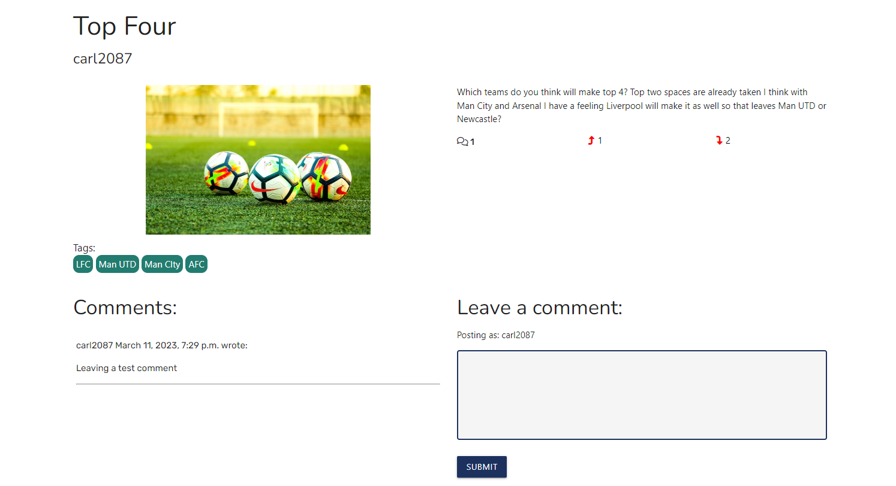

Post detail page tablet and mobile

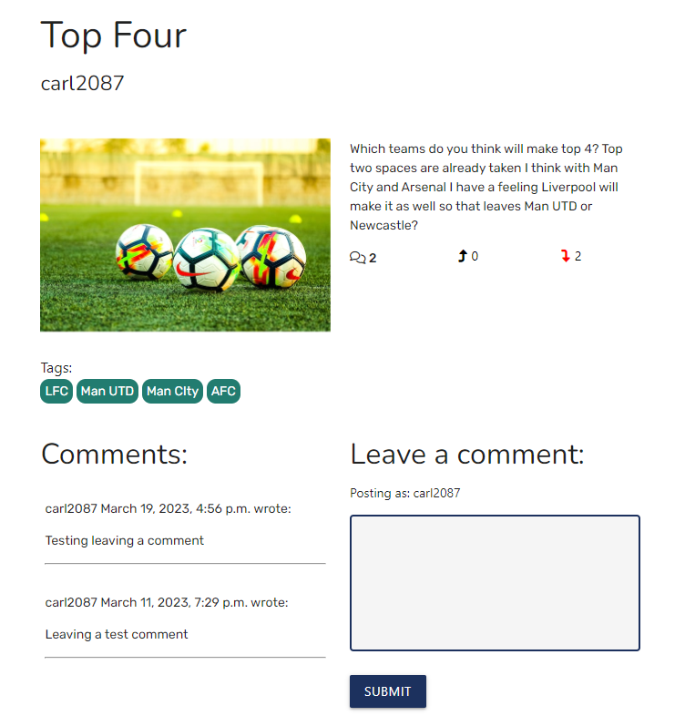
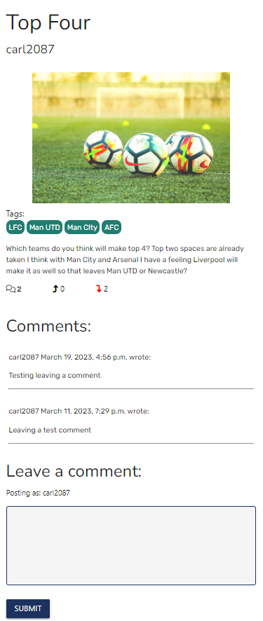

Post detail page when not logged in 

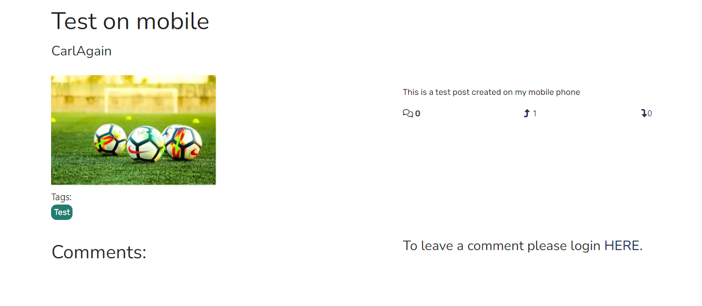

Upvote and downvote arrows

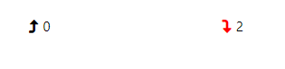

Number of comments icon

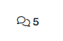

### Login and register 

To give visitors of the site the ability to register for an account and to be able to sign in etc. I used a Django app called allauth this makes it easier to set up security for users and streamlines the whole process.

Register form

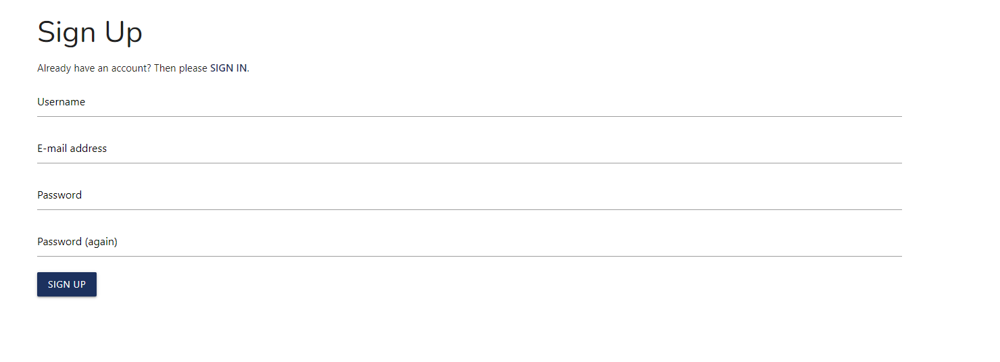

Login form

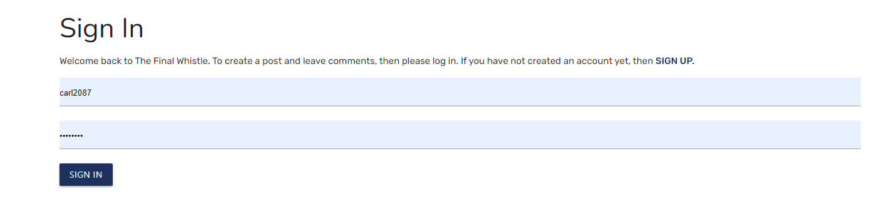

### Custom 404 page

I decided to add a custom 404 page that adds a bit of humour if the user navigates to an unknown URL, it stays within the football theme and I found the gif on 
[Giphy](https://giphy.com/happydogstickers).

404 page

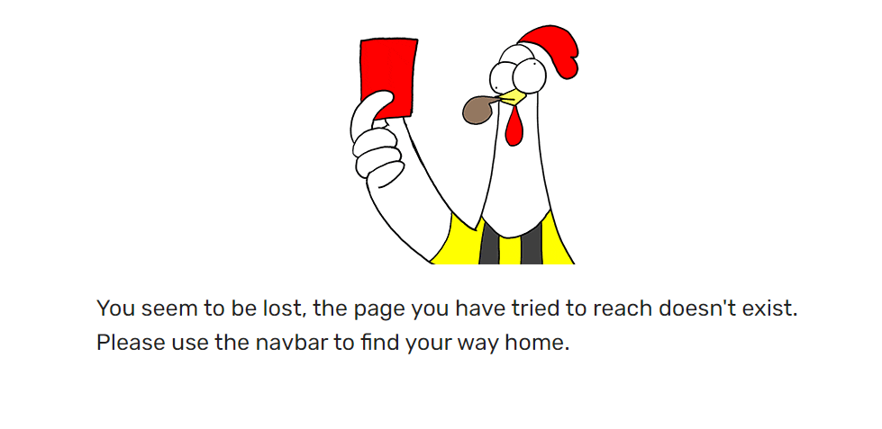

### Back to top button

For an ease of life function I included a back to top button the button only appears when the screen is scrolled down by more then 600 pixels. I did this so that when accessing the site on tablets and mobile phones it is easier to get back to the top of the page as there is quite a lot of screen scroll involved on these devices. I sourced the code for the button from [W3schools](https://www.w3schools.com/howto/howto_js_scroll_to_top.asp).

Back to top button

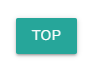

## Future Features

There is scope for a lot of expansion to The Final Whistle. The site as it is, is a minimum viable product, however there are features I would like to add in the future.

### Share button

A share button that appears on the post detail page to enable users of the site to share the posts on other social media platforms which I believe would drive more traffic to the site and would add more functionality to the site as well.

### Favourite posts

The ability to bookmark the users favourite posts to give easy access back to them, also within this feature the ability to bring up posts that the user has commented on as well so they can easily jump back into any conversations they may have been having.

### Search function

The ability to search through posts on the site by team, title, user, content and also tags that are on the posts as well. I believe this would add great functionality to the site and take more advantage of the tagging system as well.

### Social network sign in

The ability to use other social networks to log into the site this would bring the site in line with a lot of other websites and is a nice quality of life improvement.

### Password reset

To give users of the site the option to change their passwords and also reset their passwords as well if they forget what it is. When implementing this I would also add in confirmation emails to users of the site on successfully creating their accounts.

### Team database/model

I would also like to add a database for the football teams as well with individual pages that gives a brief overview and history for each club stored in the database.

[Back to table of contents](#table-of-contents)

# Technologies used

## Languages

[HTML5](https://www.w3.org/standards/webdesign/htmlcss)

* This provides the basic structure and layout of the site 

[CSS3](https://www.w3.org/standards/webdesign/htmlcss)

* This provides the custom styling for site along with the Materialize framework

[JavaScript](https://www.javascript.com/)

* This provides the front-end scripting logic for the site 

[Python](https://www.python.org/)

* This provides the back-end logic for the site handling data on the back end working hand in hand with Django

[Git](https://git-scm.com/)

* This provides version control on the site 

## Frameworks

[Materialize](https://materializecss.com/)

* A modern responsive front-end framework based on Material Design

[Django](https://www.djangoproject.com/)

* Django is a high-level Python web framework that encourages rapid development and clean, pragmatic design.

## Software used in production

[Balsamiq](https://balsamiq.com/)

* Used to build the wireframes for the project

[GitHub](https://github.com/)

* An internet hosting service used for version control. Used to host The Final Whistle repository and for the project board used for project management and user stories.

[Gitpod](https://www.gitpod.io/)

* Gitpod is a cloud development environment for teams to efficiently and securely develop software.

[Heroku](https://www.heroku.com/)

* Heroku is a platform as a service (PaaS) that enables developers to build, run, and operate applications entirely in the cloud. It is also where The Final Whistle is hosted as well.

[ElephantSql](https://www.elephantsql.com/)

* ElephantSQL installs and manages PostgreSQL databases for you.

[Cloudinary](https://cloudinary.com/)

* Cloudinary is an end-to-end image- and video-management solution for websites and mobile apps, covering everything from image and video uploads, storage, manipulations, optimizations to delivery.

[Lighthouse testing](https://web.dev/measure/?gclid=Cj0KCQjw2v-gBhC1ARIsAOQdKY3_TZb_Nus0EkkAH7Bb9l7_N7g3dud-sCco_igeA9lq3_387rdItZcaAmH5EALw_wcB)

* PageSpeed Insights (PSI) reports on the user experience of a page on both mobile and desktop devices, and provides suggestions on how that page may be improved.

[Responsive design](https://responsivedesignchecker.com/)

* This is a website that allows you to easily test if the site you have created is fully responsive across a range of devices.

[Google Chrome dev tools](https://developer.chrome.com/docs/devtools/)

* Chrome DevTools is a set of web developer tools built directly into the Google Chrome browser.

[Wave web accessibility evaluation tool](https://wave.webaim.org/)

* WAVE® is a suite of evaluation tools that helps authors make their web content more accessible to individuals with disabilities. WAVE can identify many accessibility and Web Content Accessibility Guideline (WCAG) errors, but also facilitates human evaluation of web content.

[Excel](https://www.microsoft.com/en/microsoft-365/excel)

* Microsoft Excel is the industry leading spreadsheet software program, a powerful data visualization and analysis tool.

[Slack](https://slack.com/intl/en-gb)

* Slack is an instant messaging program designed by Slack Technologies and owned by Salesforce. I use Slack to communicate with other Code Institute students to troubleshoot problems or just to help when the going gets tough!

[Back to table of contents](#table-of-contents)

# Testing

## Manual testing 

I deployed the site straight away to Heroku to ensure the Django app was set up correctly and I kept on testing the functionality of the site throughout the whole process of building The Final Whistle. When the site was completed I then went onto testing the site with third-party applications and any errors that flagged have been corrected. The issues I found during production are listed below

### HTML tags rendering in cards on the home page

This was due to Summernote not being compatible with Materialize and the HTML tags where showing in the front end. To fix this I removed summernote from my site and just used the built in Django admin area.

### Pagination links not working

The pagination links at the bottom of the screen were not working correctly. During de-bugging I found this to be an issue within the HTML code and it not being typed correctly also there was a spelling mistake. These issues were rectified.

### Post detail page not rendering

The post detail page was not rendering in the front end due to a spelling mistake in the views.py code this was fixed and the issue was no more.

There has been extensive testing to ensure that no issues to my knowledge remain.

### Edit post Modal

When editing a post when a user clicks cancel editing a modal should appear asking the user to confirm if they want to cancel the editing or return to the editing. On some occasions the modal does not appear when the cancel edit button is clicked and the user is shown the edit successful screen. I have checked the code and it is correct as the modal does show the majority of the time. 

I have created a file to fully describe the manual testing process here. [Testing documentation](testing.md)

## Validation tests

### W3C HTML

I checked the HTML of the site using the [W3C HTML validation](https://validator.w3.org/) I checked each page individually with the images below

Home page HTML

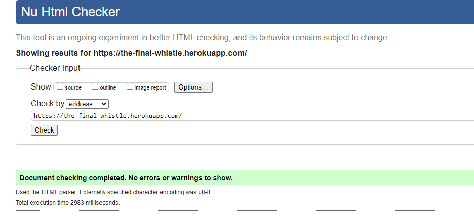

Post detail HTML

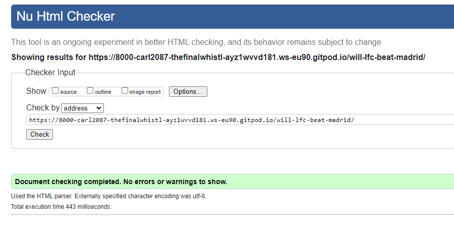

My posts HTML

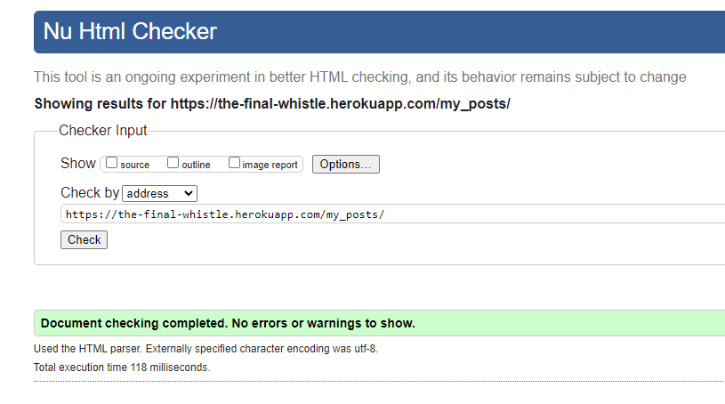

Edit post HTML

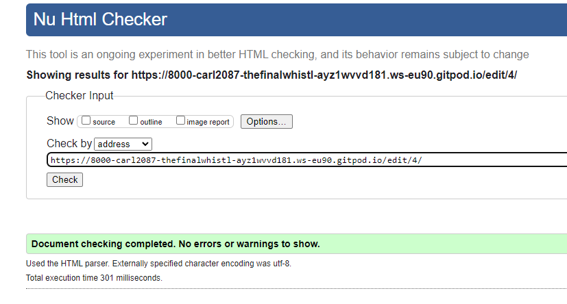

Delete post HTML

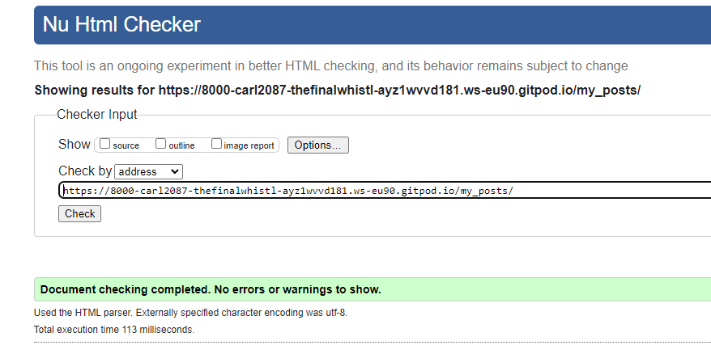

Create post HTML

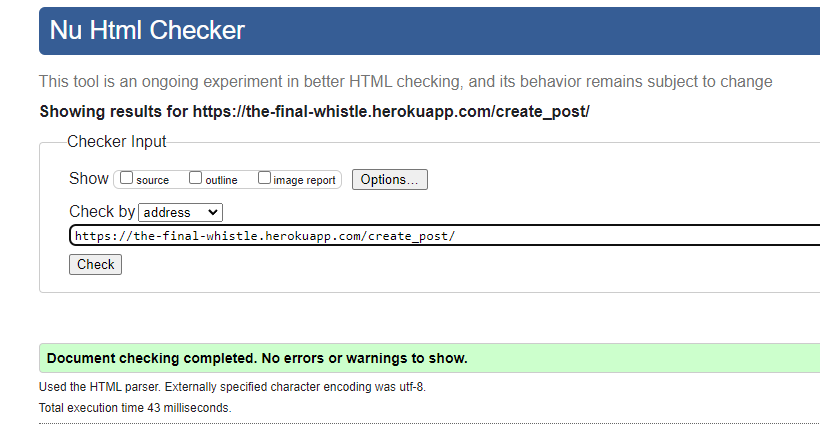

Login HTML

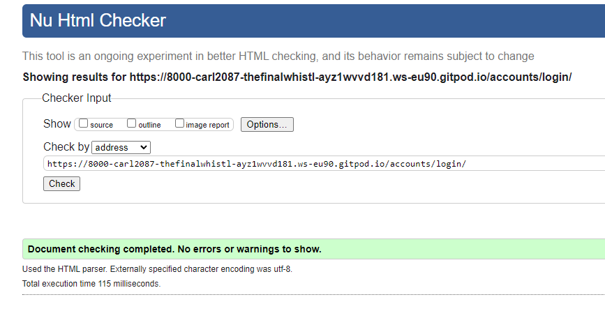

Logout HTML

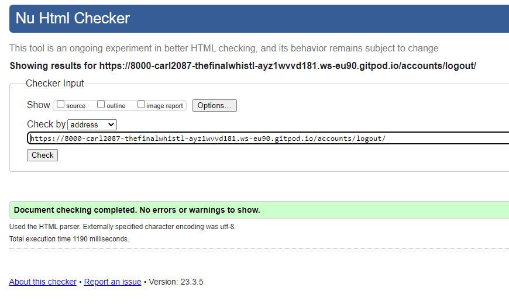

Register HTML

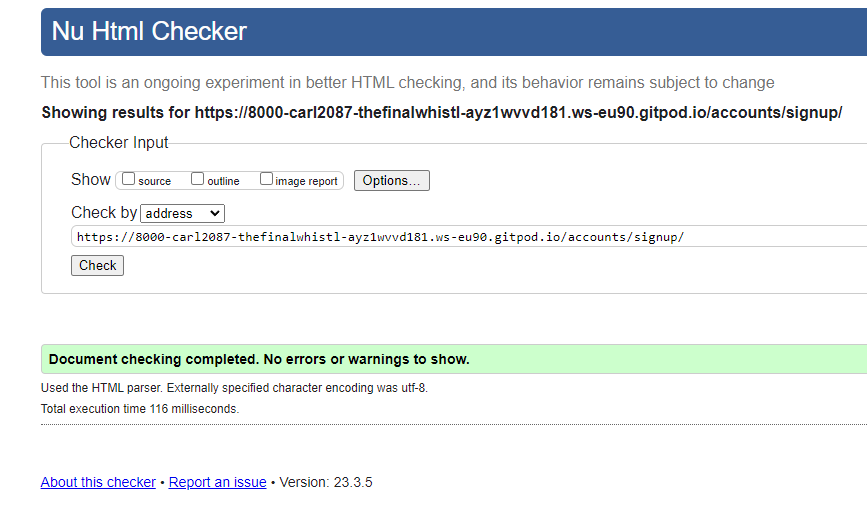

404 HTML

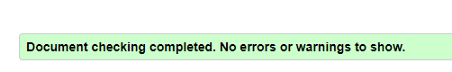

### W3C CSS

I checked the CSS of the site using [W3C CSS](https://jigsaw.w3.org/css-validator/) no errors where shown that had to be corrected.

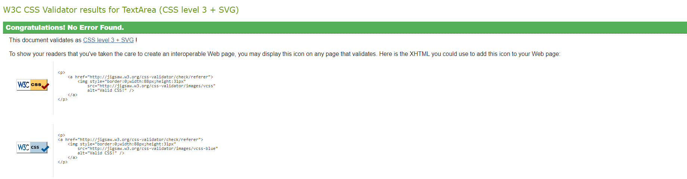

### JavaScript

I tested the JavaScript code using [jshint](assets/code-check-images/views-py-check.png) with any errors found corrected the errors that were found was a few missing semicolons.

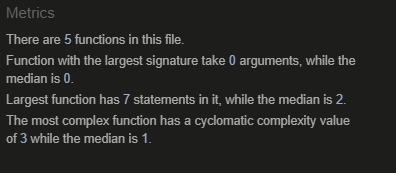

### Python 

I used [The Code Institute](https://pep8ci.herokuapp.com/) python linter to check the python code within my site with any errors shown fixed.

Admin file

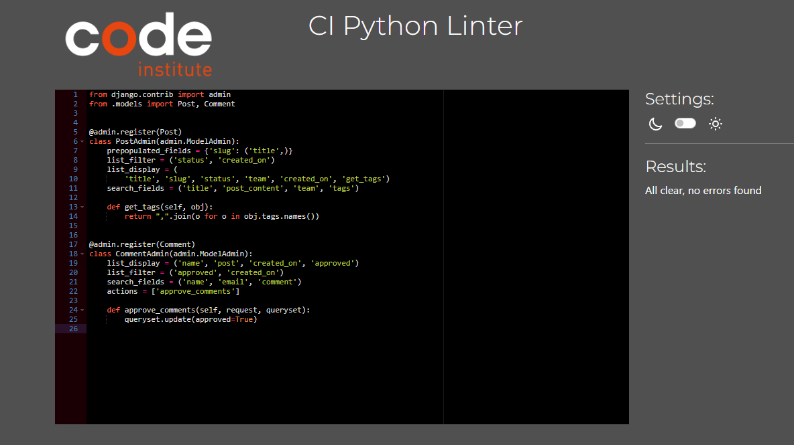

Forms file

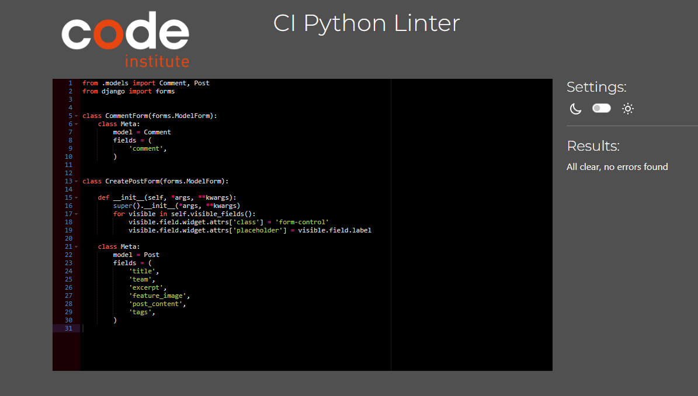

Models file

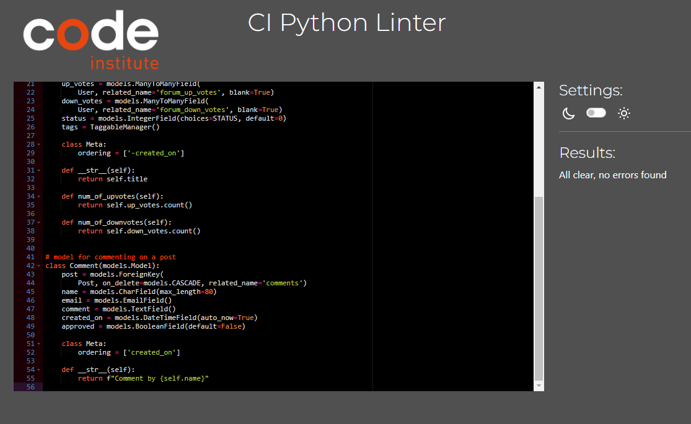

Views file

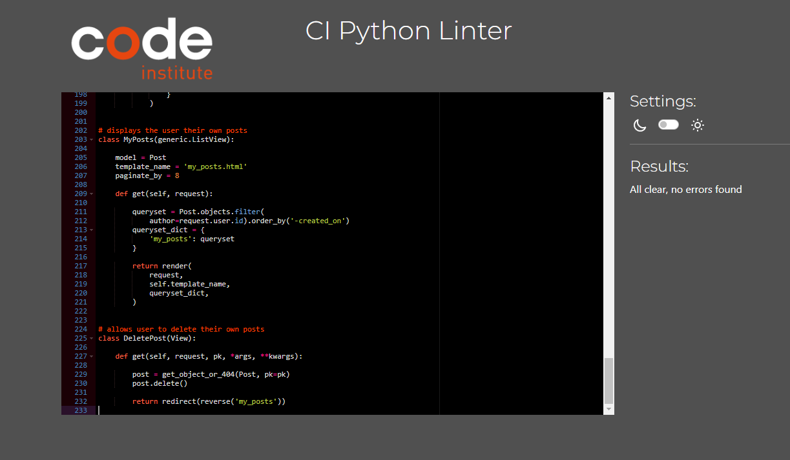

## Lighthouse testing 

I used the lighthouse testing in Chrome dev tools to test my site also. When testing the site using lighthouse I found my page had a slow load time so I implemented changes to the site code regarding this. Firstly I moved any script elements that were in the head of my HTML file to the bottom of the page and secondly I removed jQuery from my site as this was causing a lot of speed issues and updated the JavaScript code to ensure the same functionality was available. There is a difference in the lighthouse testing from the tests in the dev tools compared to the the tests completed on the PageSpeed insights website. This is regarding the best practices section on the website it is 100 and inside dev tools it is 92 it states this is because of issues raised in the issues tab but they do not show so I have been unable to fix this discrepancy.

### Lighthouse homepage test

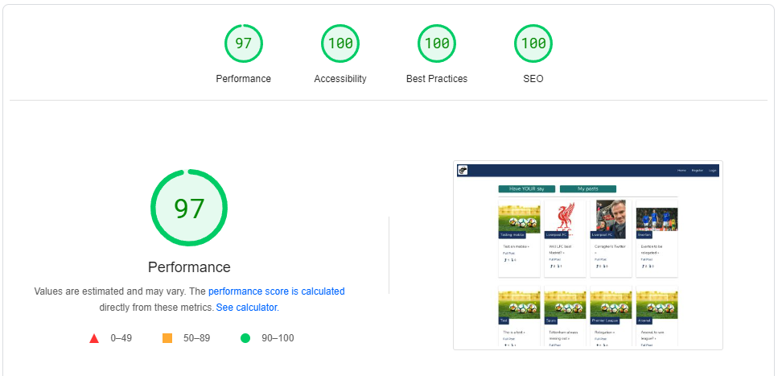

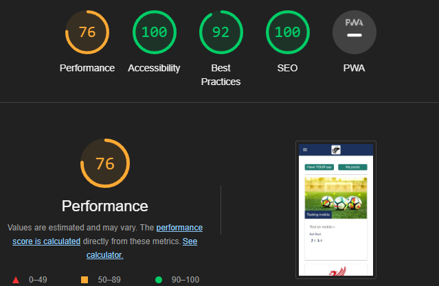

### Lighthouse my posts page

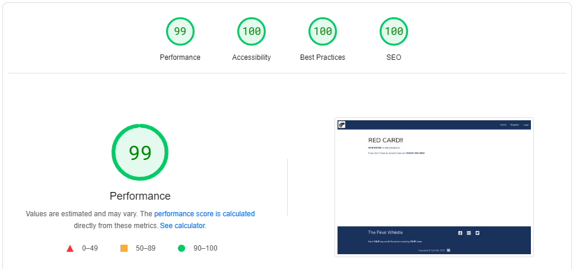

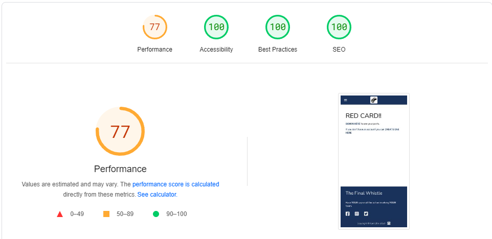

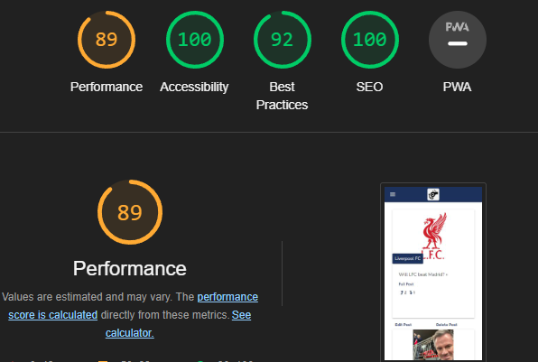

### Lighthouse post detail page

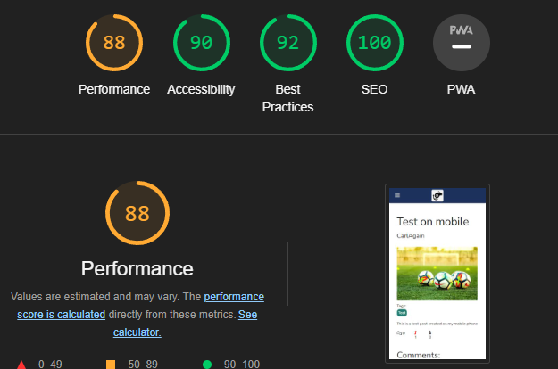

### Edit post page

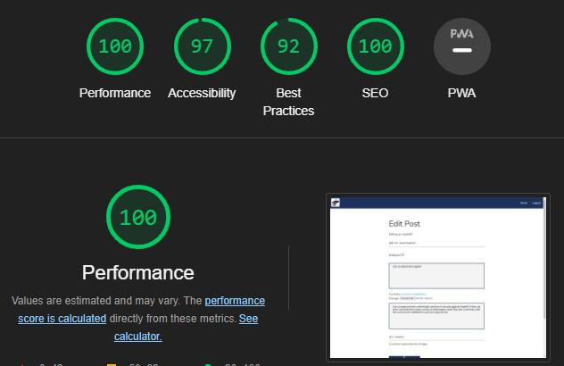

### Create a post page

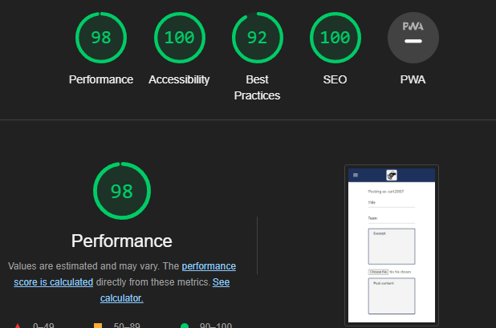

[Back to table of contents](#table-of-contents)

# Deployment

## Project Deployment via Heroku

This is a guide on how to deploy a full stack web application via [Heroku](https://www.heroku.com).

1. **Open your project in a code editor e.g [GitPod](https://www.gitpod.io/) or [VS Code](https://code.visualstudio.com/) and make sure it is connected to a GitHub repo.**

2. **Install Django and supporting libraries** 
* In the terminal type pip3 install 'django<4' gunicorn
* In the terminal type pip3 install dj_database_url psycopg2
* In the terminal type pip3 install dj3-cloudinary-storage

3. **Create a requirements file**
* type pip3 freeze --local > requirements.txt

4. **Create a Django project** 
* In the terminal type django-admin startproject 'project_name' - project_name is desired project name

5. **Create app**
* In the terminal type python3 manage.py startapp 'app_name' - app_name is desired app name

6. **Add the new app into settings.py**
* In settings.py add the app name into the installed apps array variable and save the file

7. **Migrate Changes**
* In the terminal type python3 manage.py migrate
* In the terminal type python3 manage.py runserver

8. **Create a new external database**
* Log into [ElephantSQL](https://www.elephantsql.com/) or create new account.
* Click to create new instance
* Set up the plan by giving it a name and select the tiny turtle plan (which is free)
* Select a region (data center) nearest to your location
* Click review, check that the details are correct and then click to create instance
* Return to ElephantSQL dashboard and click on the database instance name for the project
* Copy the ElephantSQL database URL using the copy icon. It begins with 'postgres://'

9. **Create the Heroku App**
* Log into [Heroku](https://www.heroku.com/) or create an account.
* Click to create new heroku app. Give the app an app name and select Europe as the region
* Open the app settings tab
* Click to reveal the config vars
* Add a config var called DATABASE_URL and paste in the ElephantSQL database URL

10. **Attach the database**
* In your code editor create a new env.py file on the top level of the project directory
* In the env.py file add import os at the top of the file
* Set environment variables inside the env file by adding - os.environ["DATABASE_URL"] = and then paste in the ElephantSQL database URL
* Set secret key variable inside the env file by adding - os.environ["SECRET_KEY"] = and then add your own secret key here
* In Heroku add the secret key variable value to the application config vars

11. **Prepare the environment and settings.py file**
* In settings.py reference and import the env.py by adding the following code to the file - 
from pathlib import Path
import os
import dj_database_url
if os.path.isfile("env.py"):
    import env
* Remove the hardcoded secret key and replace with links to the secret key variable in the env.py and in the heroku config vars by adding the following code - 
SECRET_KEY = os.environ.get('SECRET_KEY')
* Comment out the old DATABASES object variable and add a new databases variable by adding the following code - 
DATABASES = {
    'default':
    dj_database_url.parse(os.environ.get("DATABASE_URL"))
}

12. **Save all files and make migrations**
* In the terminal type python3 manage.py migrate
* Save all files

13. **Get static and media files stored on Cloudinary**
* Log in or sign up for an account on [Cloudinary](https://cloudinary.com/).
* Copy cloundinary URL API environment variable from Cloudinary dashboard
* Add cloudinary URL to env.py file by adding the following code - os.environ["CLOUDINARY_URL"] = and then paste in the Cloudinary URL
* In Heroku add in the Cloudinary URL into the application config vars on the app settings. The key should be CLOUDINARY_URL and the value should be the Cloudinary URL
* Add DISABLE_COLLECTSTATIC to Heroku config vars with a value of 1. This is a temporary step that will be removed on deployment
* Add Cloudinary libraries into installed apps in settings.py. To do this add the following code into the INSTALLED_APPS array variable - 'cloudinary_storage', 'cloudinary'. Cloudinary storage needs to be before django.contrib.staticfiles. Cloudinary needs to be after django.contrib.staticfiles.
* Tell Django to use Cloudinary to store media and static files by adding the following code into the settings.py file -
STATIC_URL = '/static/'
STATICFILES_STORAGE = 'cloudinary_storage.storage.StaticHashedCloudinaryStorage'
STATICFILES_DIRS = [os.path.join(BASE_DIR, 'static')]
STATIC_ROOT = os.path.join(BASE_DIR, 'staticfiles')
MEDIA_URL = '/media/' 
DEFAULT_FILE_STORAGE = 'cloudinary_storage.storage.MediaCloudinaryStorage'
* Link file to the templates directory in Heroku. Add the following code into the settings.py file under the BASE_DIR variable - 
TEMPLATES_DIR = os.path.join(BASE_DIR, 'templates')
* Change the templates directory to templates_dir. To do this add the following code inside the templates array variable -
'DIRS':[TEMPLATES_DIR],
* Add Heroku hostname to allowed_hosts by adding the following code into the allowed hosts variable - ["project_name.herokuapp.com", "localhost"] - project_name is the project name
* Create three new folders in top level of project directory - media, static and templates

14. **Create Procfile**
* Create a file called Procfile on the top level of the project directory
* Add the following code into the procfile - web: gunicorn project_name.wsgi - project_name is the project name
* Save all files

15. **Add, commit and push to repo**
* In the terminal type the following commands to push to the GitHub repo -
git add
git commit -m "Deployment commit"
git push

16. **Deploy the project to Heroku from the GitHub repo**
* On the Heroku project add another config var - the key should be PORT and the value should be 8000
* Under the project deploy tab, for the deployment method select GitHub. Search for the repository name and click connect. Once the project is connected scroll down to the manual deployment section and click deploy branch. Make sure you have the main branch selected

[Back to table of contents](#table-of-contents)

# Credits 

* The main image at the top of the readme is created on [Am I responsive](https://ui.dev/amiresponsive).
* The default image for the cards that feature on the site was sourced from [unsplash](https://unsplash.com/images/sports/soccer?utm_source=unsplash&utm_medium=referral&utm_content=creditCopyText) and the photo was taken by [Travel Nomades](https://unsplash.com/@travelnomades?utm_source=unsplash&utm_medium=referral&utm_content=creditCopyText).
* For other images that are on the cards they where sourced through Google or through social media posts all rights are reserved to their original owners.
* I used [Font Awesome](https://fontawesome.com/) for the social media links.

Any other resources used have been acknowledged within the readme and I am eternally grateful for all the resources that are available free of charge.

[Back to table of contents](#table-of-contents)

# Acknowledgements

I would like to thank my mentor Victor Miclovich who has given me great advice and is very clear in explaining processes. I would also like to thank the Code Institute Slack community who are great and there is always someone ready to help if you are stuck or just to pick you up if you're feeling under the pressure.

Thank you to all

Carl Ellis

[Back to table of contents](#table-of-contents)
